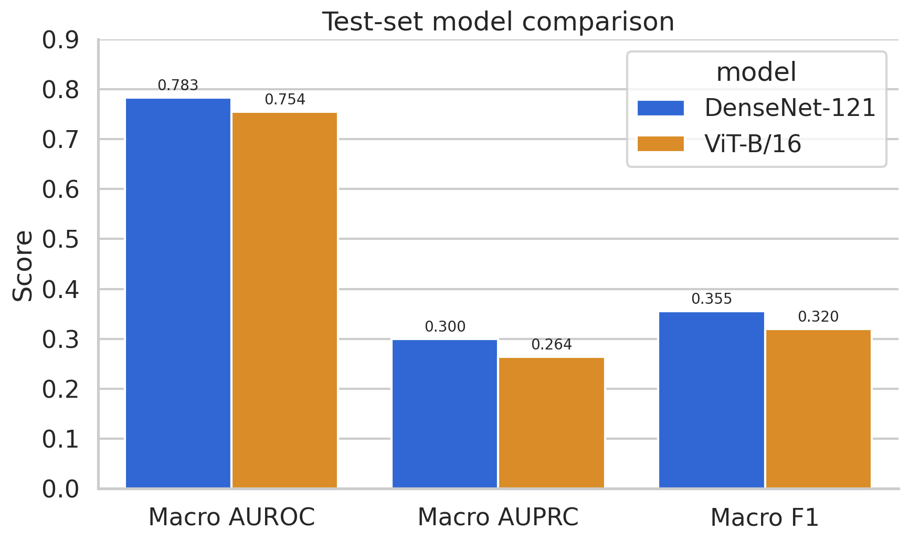
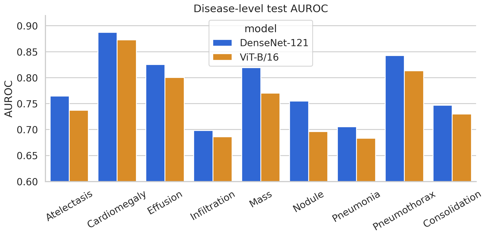
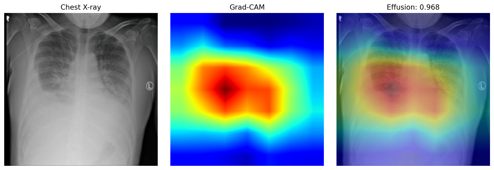

# Thoracic Disease Detection

An interpretable multi-label chest X-ray classification study comparing DenseNet-121 and
ViT-B/16 on 112,120 images from NIH ChestXray14. The repository contains the complete data,
training, evaluation, model-comparison, and Grad-CAM pipeline used to produce the reported
results.

[](https://github.com/sethu-ram-reddy/thoracic-disease-detection/actions/workflows/ci.yml)
[](https://www.python.org/)
[](https://pytorch.org/)
[](LICENSE)
[](https://colab.research.google.com/github/sethu-ram-reddy/thoracic-disease-detection/blob/main/notebooks/01_colab_training.ipynb)

> Research software only. This project is not a medical device and must not be used for diagnosis
> or clinical decision-making.



## Outcome

Under the same patient-disjoint splits, preprocessing, transfer-learning protocol, and eight-epoch
training budget, **DenseNet-121 outperformed ViT-B/16 on every reported aggregate metric and all
nine disease-level AUROCs**.

| Model | Macro AUROC | Macro AUPRC | Macro F1 | Micro AUROC | Micro AUPRC | Micro F1 |
|---|---:|---:|---:|---:|---:|---:|
| **DenseNet-121** | **0.7826** | **0.2997** | **0.3553** | **0.8061** | **0.3187** | **0.4005** |
| ViT-B/16 | 0.7544 | 0.2638 | 0.3198 | 0.7756 | 0.2850 | 0.3776 |

DenseNet-121 gained 0.0282 macro AUROC, 0.0359 macro AUPRC, and 0.0355 macro F1 over ViT-B/16.
Its strongest disease-level results were Cardiomegaly (0.8871 AUROC), Pneumothorax (0.8425),
Effusion (0.8253), and Mass (0.8195).



The lower AUPRC and F1 values, especially for Pneumonia, reflect severe label imbalance and the
difficulty of selecting operating thresholds for rare findings. They are reported alongside
AUROC to avoid presenting an overly favorable view of performance.

## Explainability check

Grad-CAM was applied to DenseNet-121's final convolutional layer for qualitative inspection. The
example below shows the original test radiograph, the activation map, and the overlay for a model
prediction. These maps help reveal where the network concentrated its evidence, but they are not
lesion segmentations or proof of clinical reasoning.



The repository includes [12 test-set Grad-CAM examples](results/densenet121/evaluation/gradcam/),
along with the complete [DenseNet-121](results/densenet121/evaluation/roc_curves.png) and
[ViT-B/16](results/vit_b16/evaluation/roc_curves.png) ROC figures.

## What the project demonstrates

- Multi-label classification for nine thoracic findings
- Full NIH ChestXray14 ingestion and audit across 112,120 radiographs
- Official NIH test split with patient-disjoint train, validation, and test partitions
- Iterative multi-label stratification at the patient level
- DenseNet-121 and ViT-B/16 ImageNet transfer learning
- Disease-specific positive weighting for class imbalance
- Mixed-precision training, checkpointing, cosine decay, and early stopping
- Validation-only threshold selection with an untouched final test evaluation
- Disease-level AUROC, AUPRC, precision, recall, and F1 reporting
- Grad-CAM inspection using DenseNet-121's final convolutional layer
- Reproducible Google Colab execution with persistent Drive outputs

## Dataset and splits

The experiment uses the [NIH ChestXray14](https://nihcc.app.box.com/v/ChestXray-NIHCC) dataset.
Images are not redistributed in this repository.

| Split | Images | Patients |
|---|---:|---:|
| Train | 73,254 | 23,806 |
| Validation | 13,270 | 4,202 |
| Test | 25,596 | 2,797 |

The official NIH test list is preserved. The official training/validation list is divided using
iterative multi-label stratification over patient-level targets. Integrity checks fail the run if
any patient appears in more than one partition.

The nine evaluated findings are Atelectasis, Cardiomegaly, Effusion, Infiltration, Mass, Nodule,
Pneumonia, Pneumothorax, and Consolidation.

## Experimental protocol

Both models receive 224 × 224 RGB inputs normalized with ImageNet statistics. Training augmentation
uses random horizontal flips and rotations up to seven degrees. The classifier head is trained for
one warm-up epoch before full fine-tuning.

Optimization uses AdamW, weighted `BCEWithLogitsLoss`, cosine learning-rate decay, gradient
clipping, and CUDA mixed precision. DenseNet-121 uses a batch size of 64 and ViT-B/16 uses 48.
Both experiments ran for eight epochs on an NVIDIA A100 80 GB GPU.

Per-disease decision thresholds are selected on validation predictions by maximizing F1 over a
fixed grid. Those thresholds are frozen before the official test set is evaluated. The design
keeps threshold tuning separate from final reporting.

See [docs/methodology.md](docs/methodology.md) for implementation details and limitations.

## Reproduce the experiment

The recommended entry point is the tested
[Colab notebook](notebooks/01_colab_training.ipynb). It downloads the Kaggle-hosted NIH dataset
directly to Colab's local SSD, preventing the severe I/O bottleneck caused by training from a
mounted Drive.

For local execution:

```bash
python -m pip install -r requirements-colab.txt
python -m pip install -e .
```

Audit an extracted dataset before training:

```bash
python scripts/audit_dataset.py --data-root /path/to/nih-chest-xray
```

Train and evaluate DenseNet-121:

```bash
python scripts/train.py \
  --config configs/densenet121.yaml \
  --data-root /path/to/nih-chest-xray

python scripts/evaluate.py \
  --config configs/densenet121.yaml \
  --data-root /path/to/nih-chest-xray

python scripts/generate_gradcam.py \
  --config configs/densenet121.yaml \
  --data-root /path/to/nih-chest-xray \
  --samples 12
```

Train and evaluate ViT-B/16:

```bash
python scripts/train.py \
  --config configs/vit_b16.yaml \
  --data-root /path/to/nih-chest-xray

python scripts/evaluate.py \
  --config configs/vit_b16.yaml \
  --data-root /path/to/nih-chest-xray
```

Generate the comparison tables and figures:

```bash
python scripts/compare_models.py \
  --densenet-dir /path/to/densenet121-output \
  --vit-dir /path/to/vit-b16-output \
  --output-dir results/comparison
```

## Repository map

```text
configs/                 Reproducible experiment definitions
docs/                    Methodology, limitations, and responsible-use notes
notebooks/               End-to-end Colab runner
scripts/                 Audit, training, evaluation, comparison, and Grad-CAM CLIs
src/thoracic_ai/         Data, models, metrics, engine, explainability, and plotting modules
tests/                   Configuration and metric unit tests
results/                 Tracked aggregate metrics and portfolio figures
```

Each training run writes its resolved configuration, leakage-safe split manifests, history,
`best.pt`, and `last.pt`. Evaluation adds validation-selected thresholds, test predictions, summary
metrics, disease-level metrics, and figures. Checkpoints and raw prediction files are intentionally
excluded from Git because of their size.

## Limitations

- ChestXray14 labels were automatically extracted from reports and contain known label noise.
- The study covers nine of the dataset's fourteen findings.
- There is no external validation on another hospital system or acquisition protocol.
- Demographic subgroup analysis and probability calibration are not included.
- Grad-CAM is a qualitative inspection method, not a lesion segmentation or causal explanation.
- Eight epochs provide a controlled architecture comparison, not an exhaustive hyperparameter
  search or state-of-the-art benchmark.

## Author

**Sethu Ram Reddy Lankala**  
M.S. Computer Engineering — Machine Learning & Intelligent Systems  
The George Washington University

## License

Code is released under the [MIT License](LICENSE). NIH ChestXray14 is distributed separately under
its own terms and is not included in this repository.
